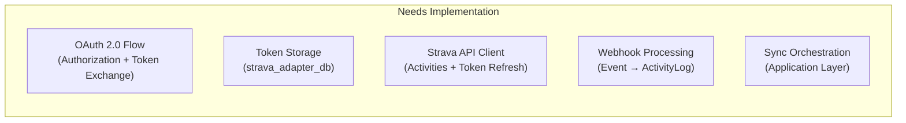
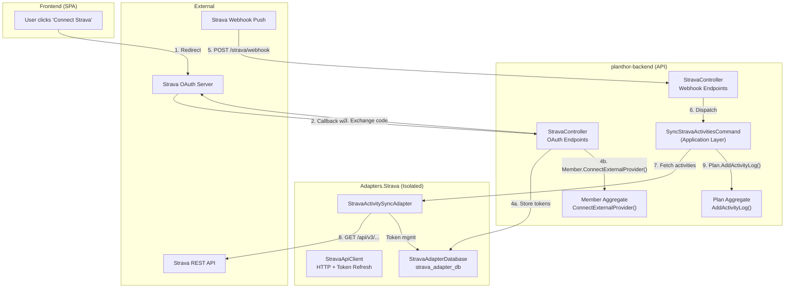
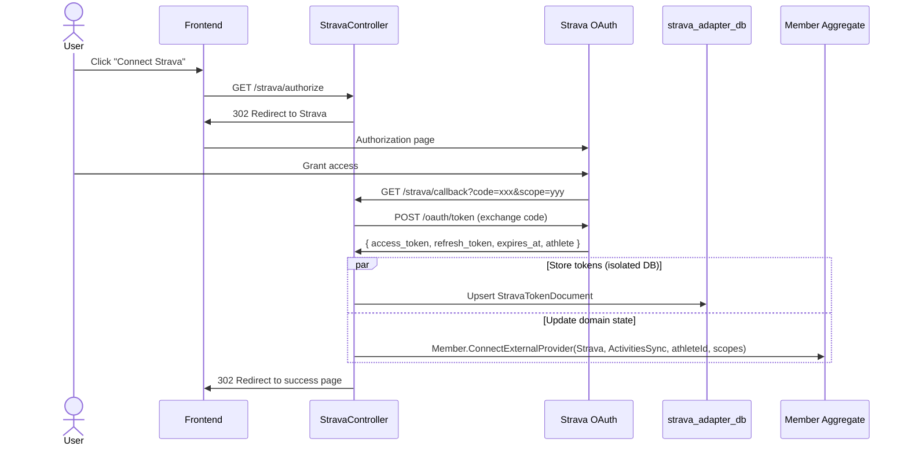
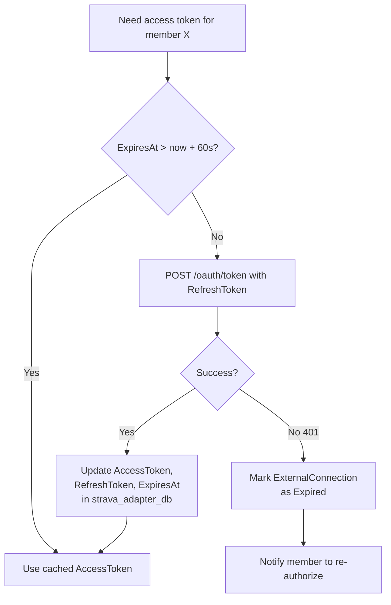
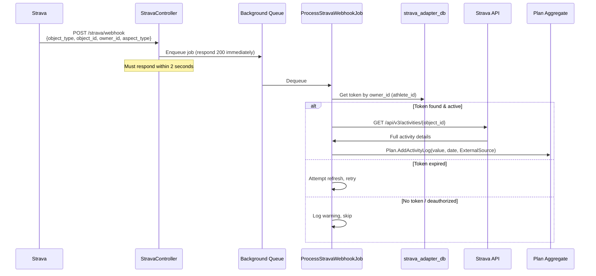
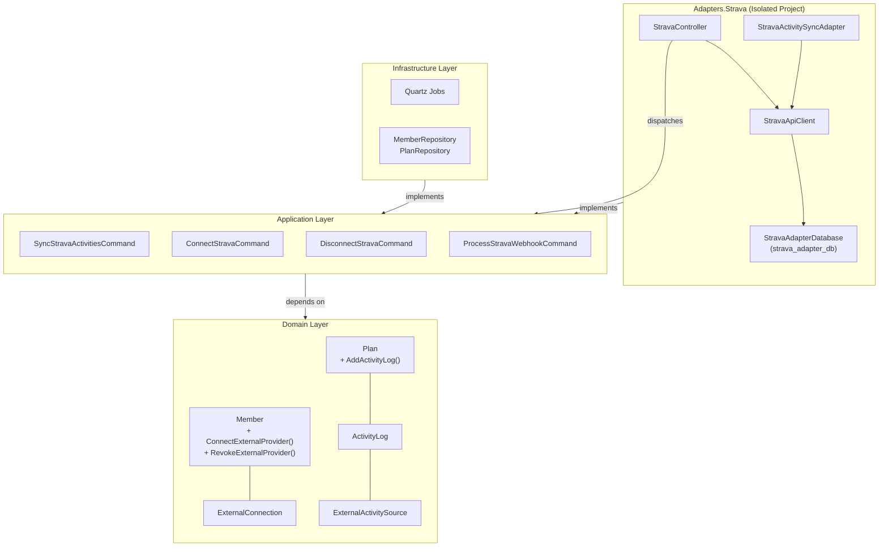

# Strava Integration — Architectural Design

## Executive Summary

This document proposes a complete architecture for integrating Strava into planthor-backend, covering the OAuth flow, token management, webhook-driven activity sync, and how it all fits into your existing Clean Architecture + DDD structure.

> [!TIP]
> Your existing foundation is **remarkably well-prepared**. The [ExternalConnection](file:///Users/trungpham/sourcecode/Planthor/planthor-backend/src/Domain/Members/ExternalConnection.cs), [ExternalProvider](file:///Users/trungpham/sourcecode/Planthor/planthor-backend/src/Domain/Members/ExternalProvider.cs), [ExternalConnectionType](file:///Users/trungpham/sourcecode/Planthor/planthor-backend/src/Domain/Members/ExternalConnectionType.cs), [IActivitySyncAdapter](file:///Users/trungpham/sourcecode/Planthor/planthor-backend/src/Adapters/Abstraction/IActivitySyncAdapter.cs), and the dedicated [Adapters.Strava](file:///Users/trungpham/sourcecode/Planthor/planthor-backend/src/Adapters/Strava) project with separate `strava_adapter_db` are exactly the right abstractions. The design below builds on these without breaking any existing patterns.

---

## 1. Current State Assessment

### What You Already Have

| Layer | Component | Status |
|-------|-----------|--------|
| Domain | `ExternalConnection` entity w/ `Provider`, `Type`, `Status`, `Scopes` | ✅ Complete |
| Domain | `ExternalProvider.Strava` smart enum | ✅ Complete |
| Domain | `ExternalConnectionType.ActivitiesSync` | ✅ Complete |
| Domain | `ConnectionStatus` (Active / Revoked / Expired) | ✅ Complete |
| Domain | `ExternalActivitySource` value object for `ActivityLog` | ✅ Complete |
| Domain | `Plan.AddActivityLog()` with auto-recalculation | ✅ Complete |
| Domain | `PersonalPlan.LinkUserAdapter` flag | ✅ Complete |
| Domain | `ExternalConnectionEstablishedEvent` / `RevokedEvent` | ✅ Complete |
| Adapter | `IActivitySyncAdapter` / `AdapterActivityDto` abstraction | ✅ Complete |
| Adapter | `StravaActivitySyncAdapter` (stub) | 🔸 Placeholder |
| Adapter | `StravaApiClient` (stub) | 🔸 Placeholder |
| Adapter | `StravaTokenDocument` / `StravaAdapterDatabase` (stub) | 🔸 Placeholder |
| Adapter | `StravaController` with webhook + manual sync endpoints (stub) | 🔸 Placeholder |
| Adapter | `StravaWebhookPayload` / `StravaVerifyRequest` (stub) | 🔸 Placeholder |

### What Needs to Be Built



---

## 2. High-Level Architecture



---

## 3. OAuth 2.0 Authorization Flow

### 3.1 Flow Sequence



### 3.2 New Endpoints on `StravaController`

| Method | Route | Auth | Purpose |
|--------|-------|------|---------|
| `GET` | `/strava/authorize` | `[Authorize]` | Builds Strava authorization URL with PKCE state, redirects user |
| `GET` | `/strava/callback` | `[AllowAnonymous]` | Receives Strava's redirect, exchanges code, stores tokens, updates domain |
| `GET` | `/strava/webhook` | `[AllowAnonymous]` | Webhook subscription validation (already stubbed) |
| `POST` | `/strava/webhook` | `[AllowAnonymous]` | Webhook event receiver (already stubbed) |
| `POST` | `/strava/sync` | `[Authorize]` | Manual activity sync trigger (already stubbed) |
| `DELETE` | `/strava/disconnect` | `[Authorize]` | Revokes Strava connection + deauthorizes on Strava side |

### 3.3 Security: Anti-CSRF `state` Parameter

```
state = Base64(AES-GCM(JSON({ memberId, nonce, timestamp }), key=config["Strava:StateEncryptionKey"]))
```

- The `state` is encrypted (not just signed) so that the callback endpoint can recover the `memberId` without requiring the user to be authenticated on the callback (since the browser follows a redirect from Strava).
- Include a timestamp and reject states older than 10 minutes.
- Store a nonce in a short-lived cache (or the token DB) to prevent replay.

### 3.4 Scopes

Request these Strava scopes:
- `activity:read_all` — read all activities (including private ones, if user consents)
- `profile:read_all` — read athlete profile to get `athlete.id`

Store the granted scopes in `ExternalConnection.Scopes` as you already designed.

---

## 4. Token Management (Isolated Storage)

### 4.1 `StravaTokenDocument` Design

```csharp
/// <summary>
/// Persists a member's Strava OAuth tokens and incremental sync watermark.
/// Stored in the <c>strava_adapter_db / strava_tokens</c> collection.
/// </summary>
public class StravaTokenDocument
{
    /// <summary>MongoDB document ID = Planthor MemberId.</summary>
    public Guid Id { get; set; }

    /// <summary>Strava athlete numeric ID.</summary>
    public long AthleteId { get; set; }

    /// <summary>Current OAuth access token.</summary>
    public string AccessToken { get; set; } = default!;

    /// <summary>Refresh token for obtaining new access tokens.</summary>
    public string RefreshToken { get; set; } = default!;

    /// <summary>UTC epoch seconds when AccessToken expires.</summary>
    public long ExpiresAt { get; set; }

    /// <summary>
    /// Watermark: UTC epoch seconds of the most recent synced activity.
    /// Used for incremental fetches.
    /// </summary>
    public long? LastSyncEpoch { get; set; }

    /// <summary>Timestamp of the last successful token refresh.</summary>
    public DateTime LastRefreshedAtUtc { get; set; }
}
```

> [!IMPORTANT]
> **Why separate database?** Your instinct is correct. Strava tokens are operational secrets with a completely different lifecycle (frequent rotation, external dependency) from your domain data. Isolating them in `strava_adapter_db`:
> - Limits blast radius if the token store is compromised
> - Allows independent backup/encryption policies
> - Keeps the `PlanthorDbContext` / EF Core model clean
> - Allows the adapter to be extracted into a separate microservice later without data migration

### 4.2 `StravaAdapterDatabase` Implementation

```csharp
public class StravaAdapterDatabase
{
    private readonly IMongoCollection<StravaTokenDocument> _tokens;

    public StravaAdapterDatabase(IMongoClient mongoClient)
    {
        var db = mongoClient.GetDatabase("strava_adapter_db");
        _tokens = db.GetCollection<StravaTokenDocument>("strava_tokens");
    }

    public Task<StravaTokenDocument?> GetByMemberIdAsync(Guid memberId, CancellationToken ct)
        => _tokens.Find(t => t.Id == memberId).FirstOrDefaultAsync(ct);

    public Task<StravaTokenDocument?> GetByAthleteIdAsync(long athleteId, CancellationToken ct)
        => _tokens.Find(t => t.AthleteId == athleteId).FirstOrDefaultAsync(ct);

    public Task UpsertAsync(StravaTokenDocument document, CancellationToken ct)
        => _tokens.ReplaceOneAsync(
            t => t.Id == document.Id,
            document,
            new ReplaceOptions { IsUpsert = true },
            ct);

    public Task DeleteAsync(Guid memberId, CancellationToken ct)
        => _tokens.DeleteOneAsync(t => t.Id == memberId, ct);
}
```

### 4.3 Token Refresh Strategy



> [!CAUTION]
> **Strava rotates refresh tokens.** Every refresh response may include a *new* refresh token. You **must** persist the new `refresh_token` immediately. Failing to do so permanently locks you out of the user's account.

### 4.4 Additional Security Recommendations

| Concern | Recommendation |
|---------|---------------|
| **Encryption at rest** | Encrypt `AccessToken` and `RefreshToken` fields using AES-256-GCM with a key from Azure Key Vault (you already use `az keyvault` in `start-infra.sh`) |
| **Client secret storage** | Store `Strava:ClientId` and `Strava:ClientSecret` in Azure Key Vault or ASP.NET User Secrets, never in `appsettings.json` |
| **Token rotation** | Always persist the new `RefreshToken` from every refresh response |
| **Concurrency** | Use optimistic concurrency (MongoDB `$set` with filter on expected `RefreshToken`) to prevent two simultaneous refreshes from overwriting each other |

---

## 5. Webhook Integration

### 5.1 Subscription Lifecycle

You set up the webhook subscription **once** (typically via a startup script or admin endpoint):

```
POST https://www.strava.com/api/v3/push_subscriptions
{
  "client_id": "YOUR_CLIENT_ID",
  "client_secret": "YOUR_CLIENT_SECRET",
  "callback_url": "https://your-domain.com/strava/webhook",
  "verify_token": "your-secret-verify-token"
}
```

Strava then sends a **GET** to your callback URL with a `hub.challenge` — you already have `StravaVerifyRequest` for this.

### 5.2 Webhook Event Processing



### 5.3 `StravaWebhookPayload` Implementation

```csharp
public class StravaWebhookPayload
{
    [JsonPropertyName("object_type")]
    public string ObjectType { get; set; } = default!;   // "activity" | "athlete"

    [JsonPropertyName("object_id")]
    public long ObjectId { get; set; }                     // Activity ID or Athlete ID

    [JsonPropertyName("aspect_type")]
    public string AspectType { get; set; } = default!;     // "create" | "update" | "delete"

    [JsonPropertyName("owner_id")]
    public long OwnerId { get; set; }                      // Strava Athlete ID

    [JsonPropertyName("subscription_id")]
    public int SubscriptionId { get; set; }

    [JsonPropertyName("event_time")]
    public long EventTime { get; set; }                    // Unix epoch seconds

    [JsonPropertyName("updates")]
    public Dictionary<string, string>? Updates { get; set; }
}
```

### 5.4 Handling Deauthorization via Webhook

When `ObjectType == "athlete"` and `AspectType == "update"` with `Updates["authorized"] == "false"`:
1. Look up `StravaTokenDocument` by `OwnerId` (athlete ID)
2. Delete the token document from `strava_adapter_db`
3. Call `Member.RevokeExternalProvider(ExternalProvider.Strava, ExternalConnectionType.ActivitiesSync)` to update domain state

---

## 6. Activity Sync Orchestration (Application Layer)

### 6.1 Two Trigger Modes

| Trigger | Source | Entry Point |
|---------|--------|-------------|
| **Webhook** | Strava pushes `activity:create` event | `ProcessStravaWebhookCommand` → Quartz job |
| **Manual** | User clicks "Sync Now" in frontend | `POST /strava/sync` → `SyncStravaActivitiesCommand` |

### 6.2 Sync Flow (Application Layer Command)

```csharp
// Application/ExternalSync/Commands/SyncStravaActivitiesCommand.cs

public record SyncStravaActivitiesCommand(Guid MemberId) : ICommand<int>;

public class SyncStravaActivitiesCommandHandler(
    IMemberRepository memberRepository,
    IPlanRepository planRepository,
    IActivitySyncAdapter stravaAdapter,  // Keyed DI: "STRAVA"
    IClock clock)
    : ICommandHandler<SyncStravaActivitiesCommand, int>
{
    public async Task<int> Handle(SyncStravaActivitiesCommand request, CancellationToken ct)
    {
        var member = await memberRepository.GetByIdAsync(request.MemberId, ct);

        // 1. Verify member has an active Strava connection
        if (!member.HasActiveConnection(ExternalProvider.Strava, ExternalConnectionType.ActivitiesSync))
            throw new InvalidOperationException("No active Strava connection.");

        // 2. Get PersonalPlans with LinkUserAdapter enabled
        var linkedPlans = member.PersonalPlans
            .Where(pp => pp.LinkUserAdapter)
            .ToList();

        if (linkedPlans.Count == 0) return 0;

        // 3. Fetch activities from Strava (adapter handles tokens internally)
        var since = /* watermark from StravaTokenDocument.LastSyncEpoch */;
        var activities = await stravaAdapter.FetchActivitiesAsync(member.Id, since, ct);

        // 4. For each activity, match to eligible plans and add activity logs
        int logsCreated = 0;
        foreach (var activity in activities)
        {
            foreach (var pp in linkedPlans)
            {
                var plan = await planRepository.GetByIdAsync(pp.PlanId, ct);

                // Skip if activity already logged (idempotency via ExternalActivitySource)
                if (plan.ActivityLogs.Any(al =>
                    al.ExternalSource?.ExternalActivityId == activity.ExternalActivityId))
                    continue;

                // Skip if activity date outside plan boundaries
                // Skip if sport type doesn't match plan's sport filter

                var source = new ExternalActivitySource(
                    ExternalProvider.Strava, activity.ExternalActivityId);

                var value = ConvertToUnit(activity, plan.Unit);

                plan.AddActivityLog(value, activityLocalDate, source, clock, member.Id);
                logsCreated++;
            }

            await planRepository.SaveAsync(plan, ct);
        }

        return logsCreated;
    }
}
```

### 6.3 Webhook → Background Job (Quartz)

For the webhook path, the controller should **not** do synchronous work. Enqueue a Quartz job:

```csharp
// In StravaController.ReceiveEvent:
[HttpPost("webhook")]
[AllowAnonymous]
public async Task<IActionResult> ReceiveEvent(
    [FromBody] StravaWebhookPayload payload, CancellationToken ct)
{
    if (payload.ObjectType == "activity" && payload.AspectType == "create")
    {
        // Fire-and-forget via Quartz
        await _scheduler.TriggerJob(
            ProcessStravaWebhookJob.Key,
            new JobDataMap
            {
                ["AthleteId"] = payload.OwnerId,
                ["ActivityId"] = payload.ObjectId
            });
    }
    else if (payload.ObjectType == "athlete" && payload.AspectType == "update")
    {
        // Handle deauthorization
        await HandleDeauthorization(payload, ct);
    }

    return Ok(); // Must respond 200 quickly
}
```

---

## 7. `StravaApiClient` Implementation

```csharp
public class StravaApiClient(HttpClient httpClient, StravaAdapterDatabase tokenDb)
{
    private const string BaseUrl = "https://www.strava.com/api/v3";

    /// <summary>
    /// Fetches a single activity by ID using the member's access token.
    /// Handles token refresh transparently.
    /// </summary>
    public async Task<StravaActivityResponse?> GetActivityAsync(
        Guid memberId, long activityId, CancellationToken ct)
    {
        var token = await GetValidTokenAsync(memberId, ct);
        if (token is null) return null;

        httpClient.DefaultRequestHeaders.Authorization =
            new AuthenticationHeaderValue("Bearer", token.AccessToken);

        var response = await httpClient.GetAsync($"{BaseUrl}/activities/{activityId}", ct);

        if (response.StatusCode == HttpStatusCode.Unauthorized)
        {
            // Token was stale despite our check — force refresh and retry once
            token = await ForceRefreshAsync(token, ct);
            if (token is null) return null;

            httpClient.DefaultRequestHeaders.Authorization =
                new AuthenticationHeaderValue("Bearer", token.AccessToken);
            response = await httpClient.GetAsync($"{BaseUrl}/activities/{activityId}", ct);
        }

        response.EnsureSuccessStatusCode();
        return await response.Content.ReadFromJsonAsync<StravaActivityResponse>(ct);
    }

    /// <summary>
    /// Fetches athlete activities page-by-page since a given epoch.
    /// </summary>
    public async Task<List<StravaActivityResponse>> GetActivitiesAsync(
        Guid memberId, long afterEpoch, CancellationToken ct)
    {
        // Paginated fetch with per_page=50, accumulate until empty page
        // Respect rate limits: 200 req/15min, 2000 req/day
    }

    private async Task<StravaTokenDocument?> GetValidTokenAsync(
        Guid memberId, CancellationToken ct)
    {
        var token = await tokenDb.GetByMemberIdAsync(memberId, ct);
        if (token is null) return null;

        // Proactive refresh if within 60s of expiry
        if (DateTimeOffset.UtcNow.ToUnixTimeSeconds() > token.ExpiresAt - 60)
        {
            return await ForceRefreshAsync(token, ct);
        }

        return token;
    }

    private async Task<StravaTokenDocument?> ForceRefreshAsync(
        StravaTokenDocument token, CancellationToken ct)
    {
        // POST to Strava /oauth/token with grant_type=refresh_token
        // CRITICAL: Persist the new refresh_token from the response
        // On failure: mark ExternalConnection as Expired
    }
}
```

---

## 8. Where This Fits in Clean Architecture



> [!NOTE]
> The **Adapters.Strava** project already references **Adapters.Abstraction** (which depends on Domain via NodaTime types). The controllers in Adapters.Strava dispatch MediatR commands from the Application layer. This keeps the dependency arrow pointing inward — Strava-specific HTTP/persistence details never leak into Domain or Application.

---

## 9. Alternative Approaches & Trade-off Analysis

### 9.1 Approach A: Keep Everything In-Process (Recommended for Now ✅)

What you have now — the Strava adapter lives inside the same deployable as planthor-backend, but uses a separate MongoDB database for tokens.

| Pros | Cons |
|------|------|
| Simple deployment (one container) | Strava rate limits affect entire backend |
| Shared Quartz scheduler | Token refresh failures could impact request latency |
| Direct MediatR dispatch | Harder to scale sync independently |
| No network hops for domain writes | |

**Verdict**: Right choice for your current stage (≤10 connected athletes). The separate database already gives you the isolation that matters most (security).

### 9.2 Approach B: Separate Microservice (Future)

Extract `Adapters.Strava` into its own deployable that communicates with planthor-backend via an async message bus.

| Pros | Cons |
|------|------|
| Independent scaling | Operational complexity (2 deployments) |
| Strava outages don't affect core API | Need message bus (RabbitMQ / Azure Service Bus) |
| Can have its own rate limit / retry policy | Eventual consistency for activity logs |
| Clean security boundary | |

**Verdict**: Migrate to this when you hit 50+ athletes or need to integrate a second provider (GitHub). Your current `IActivitySyncAdapter` abstraction makes this migration straightforward.

### 9.3 Approach C: Keycloak as Strava IDP Broker

Use Keycloak to broker Strava OAuth (like you do with Facebook), then extract tokens from Keycloak's federated identity store.

| Pros | Cons |
|------|------|
| Single OAuth flow via Keycloak | Keycloak manages token refresh on its own schedule |
| Already proven pattern (Facebook) | Hard to control Strava-specific scopes precisely |
| | Keycloak stores tokens in its Postgres — not isolated |
| | Tight coupling to Keycloak's token lifecycle |
| | Keycloak's Admin API for token retrieval is fragile |

**Verdict**: ❌ Not recommended. Strava's connection is for **data sync**, not **identity**. Mixing identity brokering with API data access creates coupling that will hurt you. Your current separation of `ExternalConnectionType.Identity` vs `ExternalConnectionType.ActivitiesSync` is exactly the right distinction — honor it.

---

## 10. Implementation Roadmap

### Phase 1 — OAuth + Token Storage (Foundation)
- [ ] Implement `StravaTokenDocument` with all fields
- [ ] Implement `StravaAdapterDatabase` with CRUD operations
- [ ] Add `GET /strava/authorize` endpoint (build authorization URL, encrypt state)
- [ ] Add `GET /strava/callback` endpoint (exchange code, store tokens, call `Member.ConnectExternalProvider()`)
- [ ] Add `DELETE /strava/disconnect` (revoke tokens on Strava, call `Member.RevokeExternalProvider()`)
- [ ] Add Strava configuration section to `appsettings.json` (ClientId, ClientSecret from Key Vault)
- [ ] Register `StravaApiClient` as typed `HttpClient` in DI

### Phase 2 — Activity Fetch + Manual Sync
- [ ] Implement `StravaApiClient.GetActivityAsync()` and `GetActivitiesAsync()`
- [ ] Implement token refresh logic with rotation handling
- [ ] Implement `StravaActivitySyncAdapter.FetchActivitiesAsync()`
- [ ] Map `StravaActivityResponse` → `AdapterActivityDto`
- [ ] Implement `SyncStravaActivitiesCommand` in Application layer
- [ ] Wire up `POST /strava/sync` to dispatch `SyncStravaActivitiesCommand`
- [ ] Add sport type matching (Strava activity type → `Plan.SportPlanDetails`)
- [ ] Add unit conversion logic (meters → km, seconds → hours, etc.)

### Phase 3 — Webhook (Real-time Sync)
- [ ] Implement `GET /strava/webhook` challenge verification (using existing `StravaVerifyRequest`)
- [ ] Implement `POST /strava/webhook` to enqueue Quartz job
- [ ] Create `ProcessStravaWebhookJob` (Quartz)
- [ ] Handle deauthorization webhook events
- [ ] Handle activity update and delete events
- [ ] Set up webhook subscription (one-time script or admin endpoint)

### Phase 4 — Resilience & Production Readiness
- [ ] Add Polly retry policies for Strava API calls (handle 429 rate limits)
- [ ] Add token encryption at rest (AES-256-GCM)
- [ ] Add idempotency checks (don't re-import same activity)
- [ ] Add monitoring / health checks for Strava connectivity
- [ ] Handle `ConnectionStatus.Expired` — notify user to re-authorize
- [ ] Add integration tests with mocked Strava API

---

## 11. Key Design Decisions Summary

| Decision | Rationale |
|----------|-----------|
| **Separate `strava_adapter_db`** for tokens | Security isolation, different lifecycle, future microservice extraction |
| **Raw `MongoDB.Driver`** (not EF Core) for adapter | Adapter has simple CRUD needs, avoids coupling to `PlanthorDbContext` |
| **Webhook + fire-and-forget Quartz job** | Strava requires <2s response; heavy processing must be async |
| **`IActivitySyncAdapter` abstraction** | Provider-agnostic; adding GitHub/Garmin later requires zero domain changes |
| **Domain events for connection lifecycle** | `ExternalConnectionEstablishedEvent` can trigger initial backfill sync |
| **Token refresh inside `StravaApiClient`** | Keeps refresh logic close to HTTP concerns, invisible to Application layer |
| **Don't use Keycloak for Strava** | Strava connection is data sync, not identity; different trust boundaries |
| **State encryption for OAuth** | Prevents CSRF and replay attacks on the callback endpoint |
